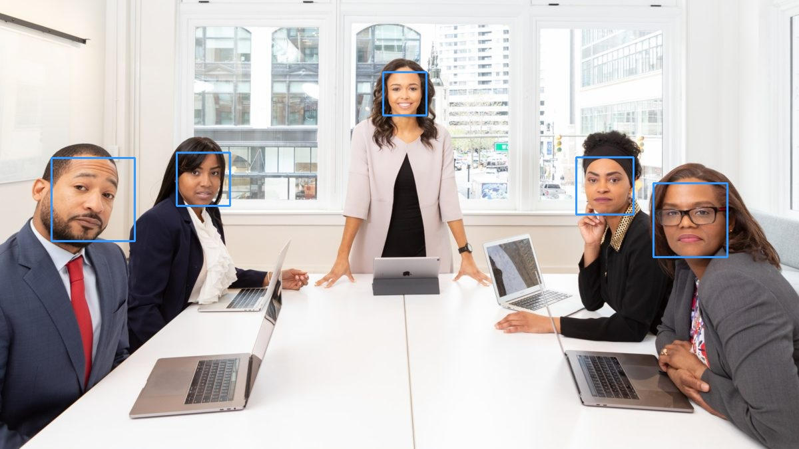

# Task 2 'OpenCV Face Detection'
To write a python code that **detect** **faces** in a given image (test image) .

## Prerequistes
-   Download the xml Cascade Classifier.
-   Image for testing.

To download the classifier , you can go to the following site [XML Cascade Classifier](https://github.com/opencv/opencv/blob/master/data/haarcascades/haarcascade_frontalface_default.xml)

## The code 

        # In this task Cascade Classifier will be used to detect faces in a photo
        import cv2
     
        # The classifier path
        faceCascade = cv2.CascadeClassifier("FrontalFace.xml")
        
        # The image path
        image = cv2.imread("TestImg.jpg")
        
        # To convert the image into grayscale
        gray = cv2.cvtColor(image, cv2.COLOR_BGR2GRAY)
        
        # Look for faces in the image using the loaded cascade file
        faces = faceCascade.detectMultiScale(gray, 1.02, 20)
        
        for (x,y,w,h) in faces:
            # Create rectangular frame around faces in the image
            cv2.rectangle(image,(x,y),(x+w,y+h),(255, 153, 51),2)
        # Will show the output in a file called 'output.jpg'	
        cv2.imwrite('output.jpg', image)
    # Uncomment this line if you want to show the output image immediately 
    # without being in a file but if did so you should comment the previous line
    # cv2.imshow('output.jpg', image)
    # cv2.waitKey()

After running the previous code ,the result is this image (output.jpg):

### Additional info:

 - **ScaleFactor** is a parameter specifying **how much** the image **size** is **reduced** at each image **scale**.
  Suppose, the **scale factor** is 1.03, it means we're using a **small step** for **resizing**,
  i.e. reduce size by 3 %, we increase the chance of a matching size with the model for detection.
  
 - **MinNeighbors** is a parameter specifying how many neighbors each candidate rectangle should have to retain it. 
  This parameter will affect the quality of the detected faces: higher value results in less detections but with higher quality.
  
  In the previous code you should **keep changing** both those scales until you get the **right** detection.

**Refernces :** 
[Face Detection Tutorial](https://www.bogotobogo.com/python/OpenCV_Python/python_opencv3_Image_Object_Detection_Face_Detection_Haar_Cascade_Classifiers.php)
[Face Detection Example](https://towardsdatascience.com/face-detection-in-2-minutes-using-opencv-python-90f89d7c0f81)

