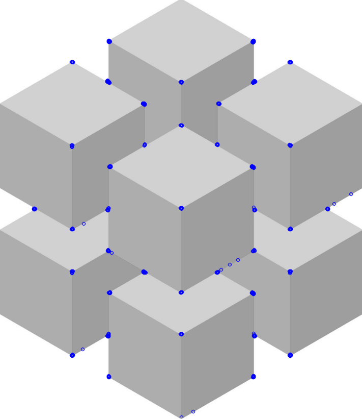

# Task 3 'OpenCV Exmple ( Corner Detection )'
To write a python code that **detect** **corners** in a given image (test image) .

## Prerequisites
-   Download the required libraries (nummpy , matplotlib).
-   Image for testing.

To download the example , you can go to the following site
[Corner Detection](https://docs.opencv.org/3.4/df/d0c/tutorial_py_fast.html)

## The code 
```python
# The following programm detects the corners in a given image 
# using FAST Algorithm for Corner Detection

import numpy as np
import cv2 as cv
from matplotlib import pyplot as plt

# Read the test image
img = cv.imread('imgy.jpg',0)

# Initiate FAST object with default values
fast = cv.FastFeatureDetector_create()

# Find and draw the keypoints
fast.setNonmaxSuppression(0)
kp = fast.detect(img,None)
img1 = cv.drawKeypoints(img, kp, None, color=(255,0,0))
# Display the output image in a file called 'output.png'
cv.imwrite('output.png',img1)
```
After running the previous code ,the result is this image (output.jpg):

### Additional info:
- **NumPy** is a python library used for working with arrays.

   It also has functions for working in domain of **linear algebra**,       **fourier transform**, and **matrices**.
  **NumPy** stands for Numerical Python.
 - **Matplotlib** is a comprehensive library for creating **static**, **animated**, and **interactive** **visualizations** in Python.
 
 - **Matplotlib.Pyplot** is a collection of command style functions that make matplotlib work like MATLAB. Each `pyplot` function makes some change to a figure: e.g., creates a **figure**, creates a **plotting** **area** in a figure, **plots** some **lines** in a **plotting** area, **decorates** the plot with **labels**, etc.
  

**Refernces :** 
- [Corner Detection](https://docs.opencv.org/3.4/df/d0c/tutorial_py_fast.html)
- [NumPy](https://www.w3schools.com/python/numpy_intro.asp)
- [Marplotlib](https://matplotlib.org/)
- [Pyplot](https://matplotlib.org/tutorials/introductory/pyplot.html)