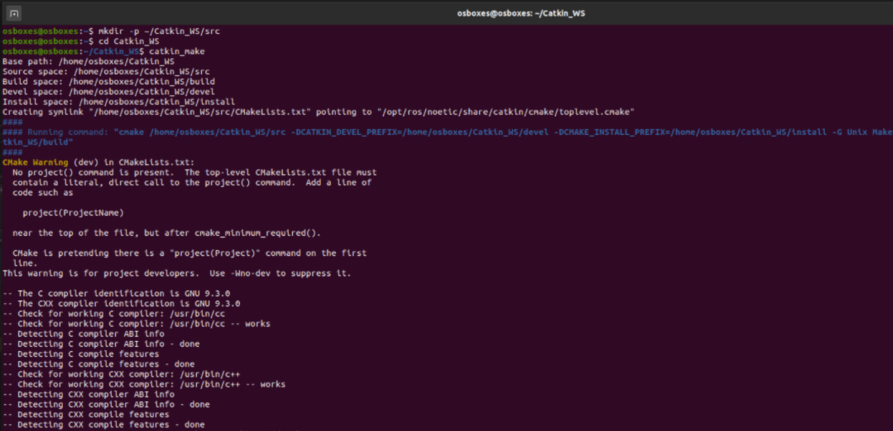
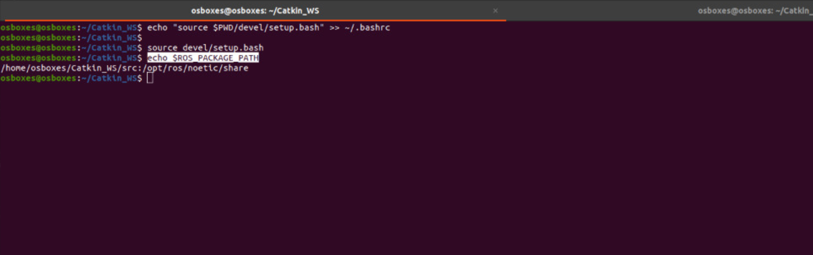
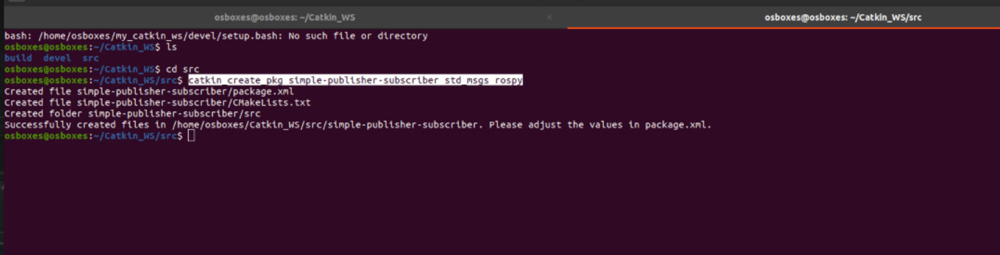
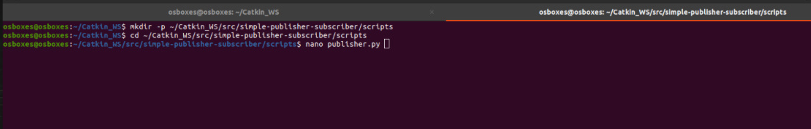
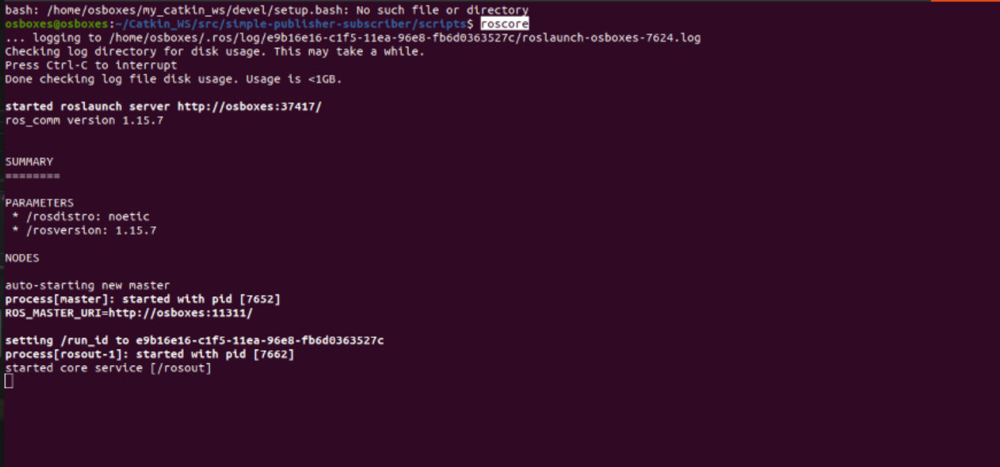
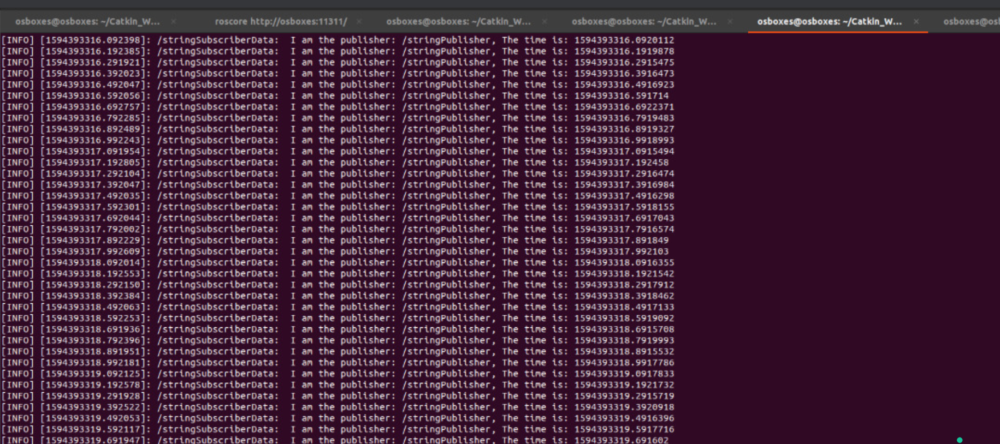
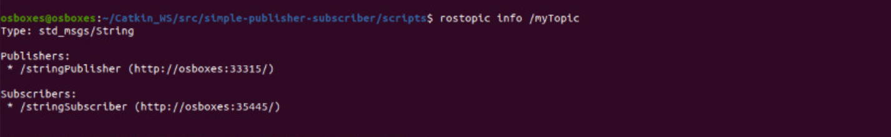

# # ROS Simple Publisher and Subscriber
To create **TWO** nodes that share a string message in a custom package and we will be doing so by following the next steps:

1.Create a ROS workspace
2.Create a new package
3.Create publisher & subscriber nodes using Python

## 1.Workspace Initilization


### 1.1 Createa workspace directory
```bash
    mkdir -p ~/my_catkin_ws/src
```
 ### 1.2 **Go** to the workspace directory

    cd ~/Catkin_WS/

### 1.3 **Run** `catkin_make` command, to **initilize** the workspace
```
catkin_make
```


### 1.4  **Source setup .*sh file**
```bash
echo "source $PWD/devel/setup.bash" >> ~/.bashrc

source devel/setup.bash
```
1.5 Check the configration
```bash
echo $ROS_PACKAGE_PATH
```

You should see the path of the workspace we made (Catkin_WS), so the output will look similar to:

> /home/osboxes/Catkin_WS/src:/opt/ros/noetic/share
## 2. Create catkin Package

### 2.1 Go to workspace 'src' directory
```bash
cd ~/Catkin_WS/src
```
### 2.2 Create a new catkin package

```
catkin_create_pkg simple-publisher-subscriber std_msgs rospy
```


**Notes:**

-   We are only using two dependencies
    - **std_msgs**: A Standard ROS Messages including common message types representing primitive data types and other basic message constructs, such as multiarrays. (i.e. to pass a string)
    - **rospy**: It is a **pure Python** client library for ROS. The rospy client API enables Python programmers to quickly interface with ROS Topics, Services, and Parameters 
 - The structure of `catkin_create_pkg` is 
 ```
 catkin_create_pkg <package_name> [depend1] [depend2] ... [dependN]
```
### 2.3 Go back to worksapce directory
```bash
cd ~/Catkin_WS
```
### 2.4 Build the workspace

```
catkin_make
```

## 3. Create The Publisher

### 3.1 Create a directory called scripts to write our publisher into
```bash
mkdir -p ~/my_catkin_ws/src/simple-pub-sub/scripts
```
### 3.2 Go to the directory
```bash
cd ~/my_catkin_ws/src/simple-pub-sub/scripts
```

### 3.3 Write the following code to a file (named publisher.py in this example) using any editor 
```python
#!/usr/bin/env python3

# Import liberaries
import rospy
from std_msgs.msg import String

def publish():
    # Publisher object, that publish 'String' to topic called 'myTopic'
    p = rospy.Publisher('myTopic', String, queue_size = 10)

    # Initialize the node with the name 'stringPublisher'
    rospy.init_node('stringPublisher')

    # Sleeping rate (10 Hz)
    rate = rospy.Rate(10)
    
    while not rospy.is_shutdown():
        # publish the string 'data' with sleep rate 10 Hz.
        data = "I am the publisher: %s, The time is: %s" % (rospy.get_name(), rospy.get_time())
        p.publish(data)
        rate.sleep()

if __name__ == '__main__':
    try:
        publish()
    except rospy.ROSInterruptException:
        pass
```
### 3.4 Give the file execution privilege
```bash
chmod +x publisher.py
```
### 3.5 On a new terminal run roscore command
```
roscore
```

### 3.6 On another terminal run the publisher script

```
rosrun simple-publisher-subscriber publisher.py 
```

### 3.7 To check our work on another terminal run the following commands

```
rostopic list
rostopic echo -n1 /myTopic
```
You should see the topic we created 'myTopic' listed, Then you will see the data.


## 4. Create The Subscriber

### 4.1 Go to the scripts directory

cd ~/Catkin_WS/src/simple-publisher-subscriber/scripts

###  4.2 Write the following code to a file (named subscriber.py in this example) using any editor
```python
#!/usr/bin/env python3

# Import lib
import rospy
from std_msgs.msg import String

def callback(data):
    # Read the data and print it in the node log.
    rospy.loginfo(rospy.get_caller_id() + "Data:  %s", data.data)

def subscriber():
    # Initialize the node with the name 'stringPublisher'
    rospy.init_node('stringSubscriber')
    
    # Subscribe to 'myTopic' reading 'String'
    rospy.Subscriber('myTopic', String, callback)

    # Don't stop until node is dead.
    rospy.spin()

if __name__ == '__main__':
    subscriber()
```
### 4.3 Give the file execution privilege
```bash
chmod +x sub.py
```
### 4.4 On another terminal run the subscriber script

```
rosrun simple-pub-sub subscriber.py 
```

**Note**:
 Make sure that **roscore** and **publisher.py** are running (points **3.5** and **3.6**)

### 4.5 To check our work

#### 4.5.1 See the terminal node of point 4.4, you should see the data from the publisher printed.
 
 
 #### 4.5.2 Run the following command, and you should see the publisher(s) and subscriber(s) of that resulted from the previous steps.
 
 