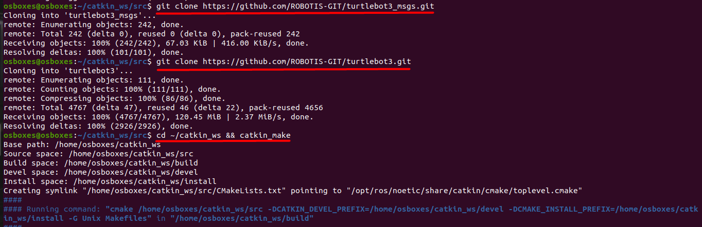
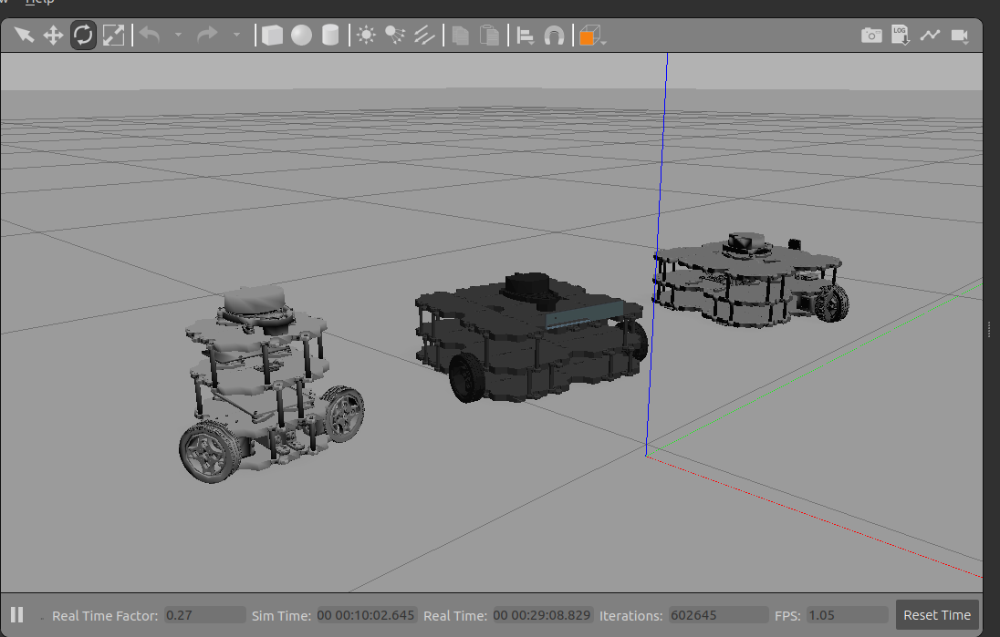
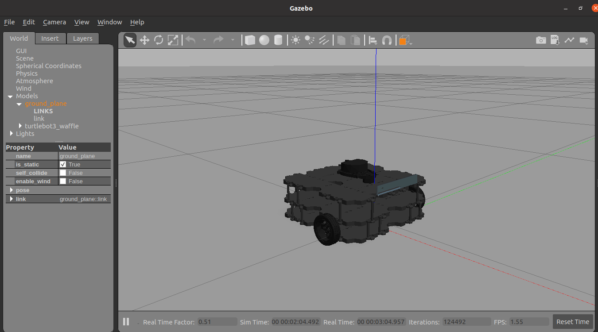
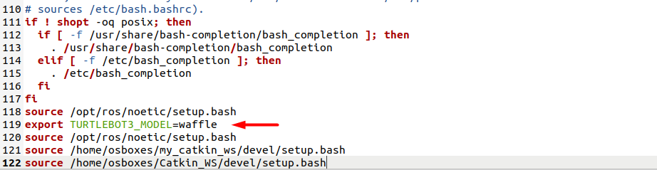
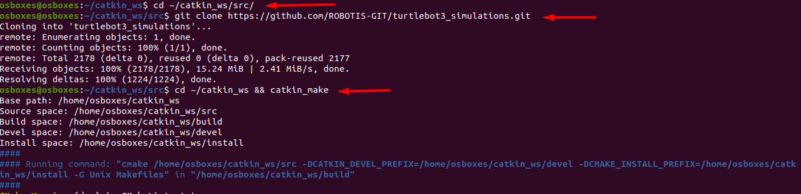
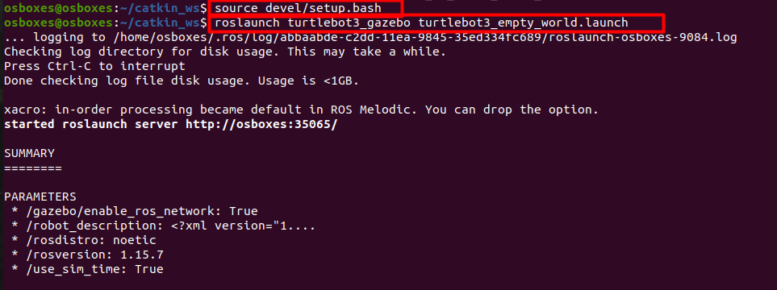
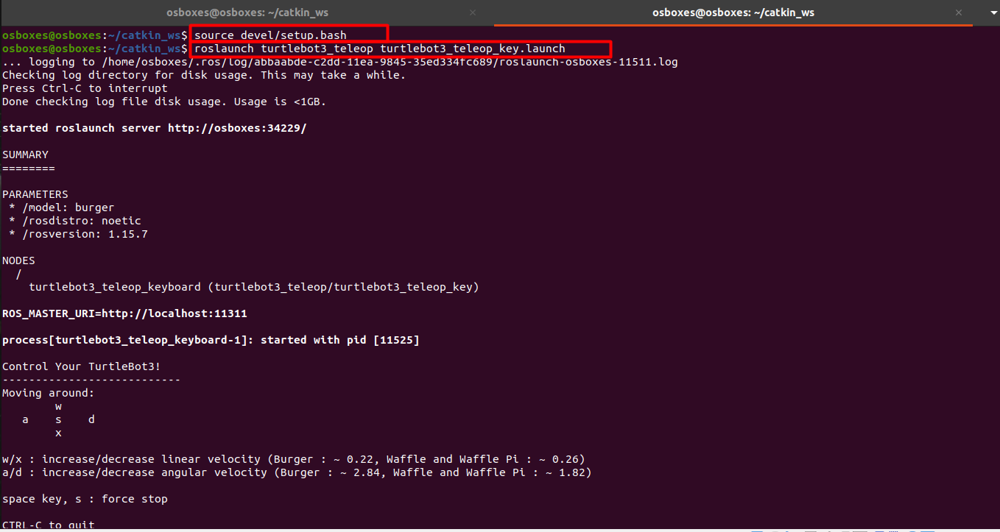

# Installing and running a TurtleBot3 simulator
In this task, our goal is to install **tutlebot3**  on the **Noetic** editiion for ROS and we will be doing so by going through the next steps:

1. Install **turtulebot3** package.
2. Install **turtulebot3_simulation** package.
3. Launch any **simulation** file.

Make sure you install all its dependences

### 1. Install the dependent packages, starting from your catkin_ws/src folder:
#### 1.1 First we will make our work space directory 
```bash
cd ~/catkin_ws/src/`
```
#### 1.2 Next , we will be downloading the related packegs
```bash
git clone https://github.com/ROBOTIS-GIT/turtlebot3_msgs.git`
```
```bash
git clone https://github.com/ROBOTIS-GIT/turtlebot3.git`
```
#### 1.3 Go back to workspace directory and build the workspace
```bash
cd ~/catkin_ws && catkin_make`
```


#### TurtleBot3 has three models : burger, waffle, waffle_pi (shown in the picture from left to right). You can choose anyone of them. 


In this example, we will using the **waffle model** 


#### Add this line  `export TURTLEBOT3_MODEL=waffle`  at the bottom of the file ( line 119 ) to go with "waffle model" after  entering the command: 
```bash
gedit ~/.bashrc`
```


Save and quit the file.


#### Reload .bashrc so that you do not have to log out and log back in.
```bash
source ~/.bashrc`
```
### 2. Download the TurtleBot3 simulation files.

```bash
cd ~/catkin_ws/src/`
```
```bash
git clone https://github.com/ROBOTIS-GIT/turtlebot3_simulations.git`
```
```bash
cd ~/catkin_ws && catkin_make
```

### 3. Launch the virtual robot using Gazebo

#### First, launch TurtleBot3 in an empty environment by :
```bash
source devel/setup.bash`
```
```
roslaunch turtlebot3_gazebo turtlebot3_empty_world.launch`
```
 
####  Your screen should look like this:


### 4. To control the movement of your TurtleBot:

#### In a new terminal tap:
```bash
 source devel/setup.bash`
```
```bash
roslaunch turtlebot3_teleop turtlebot3_teleop_key.launch`
```
 

**NOTE:**
 Use the **buttons** displayed in the **terminal** to **control** the **movement**.
 You can see the video of movement control in the `Waffle Robot Control.mp4` video in this file.
## Refrences:
1. [turtlbot3_msgs](https://github.com/ROBOTIS-GIT/turtlebot3_msgs)
2. [turtlebot3](https://github.com/ROBOTIS-GIT/turtlebot3)