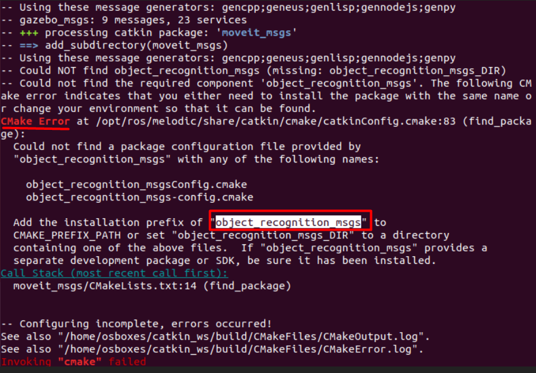
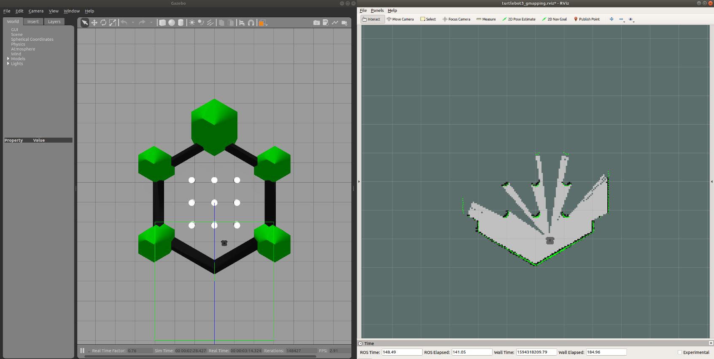
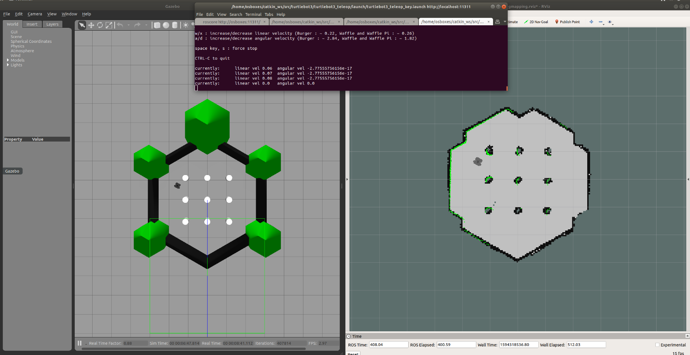

# SLAM approach using Turtlebot3 simulation

 The objective of this task is to use any **Simultaneous Localization and Mapping**
(**SLAM**) approach to create and save a map using one of the following:
-   Lidar 
-   Ultrasonic & Raspberry Pi
- Turtlebot3 simulation 
here we will be using the last way which is the **turtleot3**.

This is a Simple Guide to make a Virtual TurtleBot3 **SLAM** and **save the map**.
Simultaneous Localization And Mapping (**SLAM**) is a way to construct and\or update a map of an unknown environment.

**Note**: This example has been tested on Ubuntu **Bionic** (18.04) and ROS **melodic**.

##  Prerequisite

### 1. Make sure the following packages are on your workspace's src directory
-   [turtlebot3](http://wiki.ros.org/turtlebot3)
-   [turtlebot3_simulations](http://wiki.ros.org/turtlebot3_simulations)
-   [turtlebot3_msgs](http://wiki.ros.org/turtlebot3_msgs)
-   [slam_gmapping](http://wiki.ros.org/slam_gmapping)
-   [openslam_gmapping](http://wiki.ros.org/openslam_gmapping)

and you run the build command (on workspace directory).
```
catkin_make
```
**Note :**
Sometimes after building the packages using `catkin_make` command,some error appears, as shown in the following figure.
 
 
 And you should download the **recommended** package (in the **red** square) for the simulation then build again.
 **Important**:
 This process It might be repeated many times, this command can be used to download the whole needed packages:
 ```
 rosdep install --from-paths src --ignore-src -r -y
 ```

### 2. Set TurtleBot3 Robot Model
```bash
edit "~/.bashrc" file
```
```bash
sudo nano ~/.bashrc
```
and add the following line at the end

```bash
export TURTLEBOT3_MODEL=waffle_pi
```
As for the  tutulebot3 model , you can choose any of the following models and change its model:
-   **waffle**
-   **burger**
-   **waffle_pi** (Used in this example)
After that, run the following command on the terminal
```bash
source ~/.bashrc
```
## Run the SLAM Simulation

### 1. Run each command on a new terminal (window or tab)
```bash
roscore
```
```bash
roslaunch turtlebot3_gazebo turtlebot3_world.launch
```
```
roslaunch turtlebot3_slam turtlebot3_slam.launch slam_methods:=gmapping
```
```
roslaunch turtlebot3_teleop turtlebot3_teleop_key.launch
```
Now you should have **two** windows

1.  **Gazebo**: Which will represent the **real-life view** of the environment.
2.  **RViz**: Which will represent the **map** of the **unkown** environment.


 

Now open the **4th** terminal window (turtlebot3_teleop), and use the keys {w, a, s, d, x} to move the robot around the Gazebo environment. Also keep an eye on the RViz map as it will be updated as you move.

 

Finally, we can save the the output map using the following command on a new terminal window.
```
rosrun map_server map_saver -f ~/map
```
That will output 2 files

-   **map.pgm**
    
    Which is an image of the map. That can be interpreted later using programs (nodes) to know the perimeter\obstacles in an environment.
    
    -   **White** pixels are **empty**.
    -   **Black** pixels are **occupied**.
    -   **Transparent** pixels are **unknown**.
-   **map.yaml**
    
    Which is a meta-data file that has few important information.
    
    -   **image**: Path to the image file (.pgm or any other format image).
    -   **resolution**: meters/pixel.
    -   **origin**: The 2-D pose of the lower-left pixel in the map, as (x, y, yaw)
    -   **negate**: **Reverse** the meaning of white and black pixels in the image.
    -   **occupied_thresh**: Pixels with occupancy probability **greater** than this threshold are considered **completely occupied**.
    -   **free_thresh**: Pixels with occupancy probability **less** than this threshold are considered completely **free**.

## References
-   [ROBOTIS e-Manual: TurtleBot3 Simulation](https://emanual.robotis.com/docs/en/platform/turtlebot3/simulation/)
-    [Simultaneous Localization And Mapping](https://en.wikipedia.org/wiki/Simultaneous_localization_and_mapping)
-   [ROS Wiki: map_server](http://wiki.ros.org/map_server)